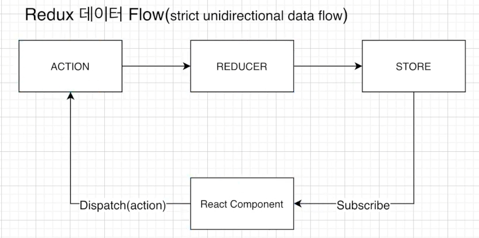

"# boiler-plate" 

## 노드 & 리액트 기초 강의를 공부중인 내용이에요!

## 노드js와 익스프레스js 설치

**노드js란

자바스크립트를 브라우저가 아닌 서버사이드에서 사용 가능

**익스프레스js

노드js가 자동차의 엔진이라면 자동차의 바퀴나 브레이크 기능 등을 만드는게 익스프레스js이다

노드js를 더 쉽게 이요하게 해주는 프레임 워크

1. 노드 다운

노드js 홈페이지에서 다운로드

터미널에서 node -v 로 버전 확인

터미널에서 폴더로 이동 → mkdir boiler-plate 로 생성

cd mkdir boiler-plate 로 이동

npm init로 패키지 생성

전부 엔터로 넘기고 author은 이름 적으면 된다.

index.js 생성 (백엔드서버를 실행시 여기에서 시작 (시작점))

익스프레스js 다운로드

터미널에서 npm install express --save 로 다운로드

위에 --save 를 쓰면 package.json에 아래 내용 생성됨

```jsx
"dependencies": {
    "express": "^4.17.1"
  }
```

위 내용을 통하여 익스프레스 사용여부 확인 가능

이후 index.js에서 기본적인 express.js 앱 만들기

https://expressjs.com/en/starter/hello-world.html

의 내용을 넣음

package.json의 스크립트에

"start": "node index.js", 내용 추가

터미널에 npm run start 을 치면  index.js를 시작점으로 서버 실행

터미널에서 Example app listening at http://localhost:5000 이라는 내용이 뜨면 성공

## 몽고DB연결

https://www.mongodb.com/kr 접속 로그인

새 데이터베이스 - FREE - 싱가폴 선택 -  티어는 무료로 선택 - 데이터베이스 이름 입력 후 생성

유저 생성

컨넥트 → 웹어플리케이션 → 코드 복사

몽구스란

몽고db를 편하게 사용하게 해주는 툴

npm install mongoose --save 로 다운

index.js 에

```
const mongoose = require('mongoose'); mongoose.connect('몽고db 키 내용', { //useNewUrlParser: true, useUnifiedTopology: true, useCreateIndex: true, useFindAndModify: false [//6.0](notion://6.0.0.0/) 버젼부터 기본이기 때문에 넣을 필요 없다. }).then(()=> console.log('몽고디비 연결 완료')) 
  .catch(err => console.log('에러',err));
```


추가

## 몽고DB 모델&스키마

모델이란?

스키마를 감싸주는것

스키마란?

테이블

폴더 하나를 생성 (models) 안에 User.js 파일 생성

몽구스 스키마를 가져온다.   (const mongoose = require('mongoose');)

## 깃 설치

깃을 다운받고

프로젝트 터미널 열기

git init 로 깃 저장소 설치

git status 로 상태 확인

git add .

git commit -m "공부"

깃은 툴 소스코드를 관리할수 있는 툴

깃헙은 클라우드 서비스

git remote add origin https://github.com/Sewoong-Lee/boiler-plate.git

git branch -M main

git push -u origin main

## BodyParser & PostMan & 회원가입

Body-parser 다운로드

npm install body-parser --save 로 다운

포스트맨 준비

Register Route 만들기

인덱스js에

```jsx
const { User } = require("./models/User"); //유저 모델을 가져옴

//application/x-www-form-urlencoded 형태의 데이터를 분석해서 가져올 수 있게끔
app.use(express.urlencoded({extended: true}));
//application/json 타입을 분석해서 가져올 수 있게끔
app.use(express.json());

app.post('/register', (req, res)=>{
  //회원 가입시 필요한 정보들을 클라이언트에서 가져오면
  //그것들을 데이터베이스에 넣어준다.
  const user = new User(req.body) //바디파서를 통하여 req에 데이터를 읽어 가져온다.
  user.save((err, userInfo)=>{
    if(err) return res.json({success: false, err})
    return res.status(200).json({
      success: true
    })
  })
})
```

추가

포스트맨에서

http://localhost:5000/register

json 타입으로 User 모델의 값 넘길시 석세스 출력 확인

## Nodemon

노드몬이란? - 노스서버를 키고 무언가를 바꾸면 서버를 다시 켜야 반영이 되지만

서버를 재시작 안해도 소스의 변경된 부분을 감지해서 반영해줌

npm install nodemon --save-dev

(dev란 로컬에서만 사용을 하겠다는 뜻)

이후 package.json 의 스크립트에

"baceknd": "nodemon index.js",

추가해서 위에걸 사용해서 npm run baceknd 로 실행함

## 비밀 설정 정보 관리

mongoose.connect 부분은 외부 유출이 되면 안되는 부분 이므로 비밀설정

config 라는 폴더 생성

dev.js, prod.js, key.js 파일 생성

dev는 로컬 환경 변수 설정

prod는 배포 단계

key는 환경에 따라 키를 넘겨주는 역할

로컬에서는 폴더내에 변수를 사용하지만

배포시 해당 배포사이트에서 변수를 관리해주기 때문에 나누어 관리

index.js 에서

const config = require('./config/key'); //몽고db 키를 가져오고

```jsx
mongoose.connect(config.mongoURI, {
    //useNewUrlParser: true, useUnifiedTopology: true, useCreateIndex: true, useFindAndModify: false //6.0 버젼부터 기본이기 때문에 넣을 필요 없다.
}).then(()=> console.log('몽고디비 연결 완료'))
  .catch(err => console.log('에러',err));
```

보안 내용을 변수로 변경

.gitignore 에 dev.js 추가


## Bcrypt로 비밀번호 암호화

Bcrypt 라이브러리를 활용하여 비밀번호를 암호화 예정

https://www.npmjs.com/package/bcrypt  참고

npm install bcrypt --save

로 라이브러리 다운로드

salt를 이용하여 비밀번호 암호화

saltRounds 란 salt가 몇글자인지 (10이면 10자리로 생성한다)

User 모델에서 User을 담기 전에

```jsx
const bcrypt = require('bcrypt');
const saltRounds = 10; //salt 길이

uesrSchema.pre('save', function( next ){
    var user = this; //위의 스키마를 가리킴 (index.js 에서 스키마에 값을 넣어줬기 떄문에 여기에서 값을 가져오면 된다.)

    if(user.isModified('password')){//비밀번호가 변경될때만 암호화 하도록 조건문을 걸어줌

        //비밀번호를 암호화 시킨다.
        bcrypt.genSalt(saltRounds, function(err, salt) {
            if(err) return next(err); //에러가 나면 에러를 반환

            bcrypt.hash(user.password, salt, function(err, hash) { //위의 비밀번호값과 솔트를 넘김
                if(err) return next(err); //에러가 나면 에러를 반환
                user.password = hash; //스키마의 비밀번호를 암호화 비밀번호로 변경
                next() //index.js 로 다시 돌아감
            });
        });
    }else { //다른거를 바꿀때는 그냥 넘김
        next()
    }
})
```

내용 추가

/register 라우터

```jsx
const user = new User(req.body)
```

단계에서 비밀번호를 암호화 하여 user에 넘겨주어 암호화된 비밀번호로 데이터베이스에 저장


## 로그인 기능

로그인을 하기위해

1. 요청된 이메일을 데이터베이스에서 있는지 찾는다.
2. 요청한 이메일이 있다면 비밀번호가 맞는지 확인.
3. 비밀번호까지 맞다면 유저를 위한 토큰을 생성

```jsx
//로그인기능 라우터
app.post('/login', (req, res)=>{
  // 1)요청된 이메일을 데이터베이스에서 있는지 찾는다.
  User.findOne({email: req.body.email }, (err, user) => {
    if(!user){//이메일이 없다면
      return res.json({
        loginSuccess: false,
        msg: "등록된 이메일이 없습니다."
      });
    }
    // 2)요청한 이메일이 있다면 비밀번호가 맞는지 확인.
    user.comparePassword(req.body.password, (err, isMatch)=>{
      if(!isMatch){ //비밀번호가 틀렸으면
        return res.json({
          loginSuccess: false,
          msg: "비밀번호가 틀렸습니다."
        });
      }
      //비밀번호까지 맞다면 유저를 위한 토큰을 생성
      user.generateToken((err, user) => {
        if(err) res.status(400).send(err);
        //토큰을 쿠키에 저장한다. 
        res.cookie("x_auth", user.token) //쿠키에  x_auth이름으로 저장
        .status(200)
        .json({ loginSuccess: true, userId: user._id});
      })

    })
  })
})
```

User 모델에서 비밀번호가 맞는지 확인 메소드

```jsx
//비밀번호가 맞는지 확인
uesrSchema.methods.comparePassword = function(plainPassword, cb){
    //plainPassword(사용자가 친 패스워드) 와 암호화된비밀번호 가 같은지 체크
    bcrypt.compare(plainPassword, tins.password, function(err, isMatch){
        if(err) return cb(err),
        cb(null, isMatch)
    })
}
```

토큰 생성

토큰을 위한 라이브러리 다운로드

npm install jsonwebtoken --save

https://www.npmjs.com/package/jsonwebtoken 참고

토큰에 쿠키를 저장하기위한 라이브러리 다운

npm install cookie-parser --save

index.js에

```jsx
const cookieParser =  require('cookie-parser');

//쿠키파서 사용 선언
app.use(cookieParser());
```

User.js 에 토큰 생성 메소드

```jsx
//웹 토큰 생성 
uesrSchema.methods.generateToken =function(cb){
    var user = this;

    //jsonwebtoken을 이용해서 웹토큰 생성
    var token = jwt.sign(user._id.toHexString(), 'secretToken');
    //user._id + 'secretToken' -> 'secretToken' -> user._id
    user.token = token; //생성한 토큰을 스키마 안에 넣음
    user.save(function(err, user){
        if(err) return cb(err);
        cb(null, user);
    });
}
```


## Auth 기능 만들기

토큰의 권한을 구분하여 해당 페이지에 진입이 가능한지 검증하는 기능

index.js에서 auth 기능 생성

```jsx
app.get('/api/users/auth', auth, (req, res) => {
  //auth 라는 미드웨어를 생성 (엔드포인트에서 리퀘스트를 받고 콜백 펑션을 하기전에 중간에서의 작업) 
})
```

루트 디렉토리에 middleware 폴더 생성, auth.js 파일 생성

index.js 에 auth 불러옴

```jsx
const { auth } = require("./middleware/auth");
```

auth.js 에

```jsx
const { User } = require("./models/User"); //유저 모델을 가져옴

let auth = (req, res, next)=> {
    //이 안에서 인증처리를 진행
    //클라이언트 쿠키에서 토큰을 가져옴
    let token = req.cookise.x_auth;

    //가져온 토큰을 복호화 한후, 유저를 찾는다.
    User.findByToken()

    //유저가 있으면 인증 ok

    //유저가 없으면 인증 no
}

module.exports = {auth};
```

추가 현재 User.js에 findByToken() 메소드가 없으므로 User.js에 해당 메소드를 생성

```jsx
uesrSchema.statics.findByToken = function(token, cb){
    var user = this;
    //복호화 하는 작업
    //토큰은 decode한다.
    jwt.verify(token, 'secretToken', function(err, decode){
        //유저 아이디를 이용해서 유저를 찾은 다음
        //클라이언트에서 가져온 token과 DB에 보관된 토큰이 일치하는지 확인

        user.findOne({ "_id": decode, "token": token}, function(err, user){
            if(err){
                return cb(err);
            }
            cb(null, user);
        })
    })
}
```

auth.js에서 auth 기능 완성

```jsx
const { User } = require("./models/User"); //유저 모델을 가져옴

let auth = (req, res, next)=> {
    //이 안에서 인증처리를 진행
    //클라이언트 쿠키에서 토큰을 가져옴
    let token = req.cookise.x_auth;

    //가져온 토큰을 복호화 한후, 유저를 찾는다.
    User.findByToken(token, (err, user) =>{
        if(err) throw err;
         //유저가 없으면 인증 no
        if(!user) return res.json({ isAuth: false, error: true})

        //유저가 있으면 인증 ok
        //index.js에서 사용할 수 있도록 req에 토큰과 유저 정보를 넣어줌
        req.token = token;
        req.user = user;
        next();
    })
}

module.exports = {auth};
```

index.js 에서 auth 기능 완성

```jsx
//Auth 기능 생성
app.get('/api/users/auth', auth, (req, res) => {
  //auth 라는 미드웨어를 생성 (엔드포인트에서 리퀘스트를 받고 콜백 펑션을 하기전에 중간에서의 작업) 

  //미들웨어를 거치고 왔다면 Authentication 이 True 라는말 이므로 클라이언트에 전달 해줘야함
  res.status(200).json({
    _id : req.user._id,
    isAdmin: req.user.role === 0 ? false : true, //0이면 일반 아니면 관리자
    isAuth: true,
    email: req.user.email,
    name: req.user.name,
    lastname: req.user.lastname,
    role: req.user.role,
    Image: req.user.Image
  })
})
```

## 로그아웃 기능 만들기

1. 로그아웃 라우트 만들기
2. 로그아웃 하려는 유저를 데이터베이스에서 찾는다
3. 그 유저의 토큰을 지워준다.

index.js에서 해당 라우트 만들기

```jsx
//로그아웃 라우트 만들기
app.get('/api/users/logout', auth, (req, res) => {
    User.findOneAndUpdate({ _id: req.user._id}, 
      { token: ""}
      , (err, user) => {
        if(err) return res.json({ success: true, err});
        return res.status(200).send({
          success: true
        })
      })
})
```

### 컴포넌트로 나눠서 재사용이 용이함

### 리얼돔은 리스트들이 10개 있다면 그중 한개가 변화가 있다면 10개를 다 리렌더 해야하지만

### 버츄얼돔은 하나만 바뀐걸 인지하고 업데이트함

### 버츄얼돔이 스넵샷 찍어놓은거와 바뀐부분을 찾는다 이 과정을 diffing 이라 한다.

웹팩이란?

많은 모듈을 합쳐서 하나로 만들어준것

## 리액트 설치 (npx)

client 폴더를 만들고 터미널 이동

npx create-react-app . 으로 다운(닷을 쳐줘야한다.)

xcode-select --install (에러가 나면 xcode 인스톨)

## npm & npx

npm? (노드패키지매니져)

레지스트리 저장소 역할

package.json에 정의가 되어있다.

-g가 빠져있으면 로컬에 다운받는다. (노드모듈 폴더에)

-g가 있으면 컴퓨터 자체에 다운받는다.

npx?

기존에는 글로벌로 다운 받았으나

npx로 다운받지 않고 레지스트리에서 가져다가 쓸수 있다.

디스크 낭비 하지않고,

항상 최신버전을 사용 가능

## 리액트(npx) 구조 설명

client 폴더에서 npm start 로 리액트 실행 (패키지제이슨 스크립트에 선언되어있음)

## CRA to Our Boilerplate

_actions, _reducer → 리덕스를 위한 폴더들

components/views → 페이지들이 있는 폴더

components/views/Sections → 해당 페이지들의 css나 컴포넌트를 넣는다.

App.js → 라우팅 관련 처리

Config.js → 환경변수같은 것들을 정의

hoc → Higher Order Component 의 약자로 여러군 내부 컴포넌트를 가진 파일들

utils → 여러군데에서 쓰일 수 있는것들을 한곳에 묶음

## React Router Dom

튜토리얼 링크

https://v5.reactrouter.com/web/example/basic

npm install react-router-dom --save

라우터돔 설치

**버전이 바뀌어 스위치를 사용하지 않음

```jsx
//App.js

import React from 'react'
import {
  BrowserRouter as Router,
  Routes,
  Route
} from "react-router-dom";
import LandingPage from './components/views/LandingPage/LandingPage'
import LogInPage from './components/views/LogInPage/LogInPage'
import NavBar from './components/views/NavBar/NavBar'
import RegisterPage from './components/views/RegisterPage/RegisterPage'
import Footer from './components/views/Footer/Footer'

function App() {
  return (
    <Router>
      <Routes>
        <Route path={"/login"} element={<LogInPage />} />
        <Route path={"/register"} element={<RegisterPage />} />
        {/* <Route path={"/"} element={<NavBar />} /> */}
        {/* <Route path={"/"} element={<Footer />} /> */}
        <Route path={process.env.PUBLIC_URL + "/"} element={<LandingPage />} />
      </Routes>
    </Router>
  )
}

export default App
```

## 데이터 Flow & Axios

서버 (노드) 와 클라이언트(리엑트) 부분으로 나뉘며

서버에서 데이터베이스와 통신이 이루어짐

클라이언트에서 요청한 데이터를 서버에서 받고 데이터베이스와 통신 후 확인함

클라이언트에서 서버로 데이터를 보낼때 Axios 라이브러리를 사용예정(ajax같은)

npm install axios --save

로 엑시오스 다운로드

LandingPage.js에 테스트용 작성

```jsx
import React, { Component, useEffect } from 'react';
import axios from 'axios';

function LandingPage() {
    useEffect(()=>{
        axios.get('/api/hello')
        .then(res => console.log(res.data))
    }, []);

    return(
        <div> 
            LandingPage 랭딩랭딩
        </div>
    )
}

export default LandingPage;
```

서버의 index.js 에도 받을 컴포넌트 생성

```jsx
app.get('/api/hello', (req,res)=> {
  res.send("엑시오스 접촉")
})
```

현재 포트번호가 다른걸 잡아줘도 에러가 나옴

서버는 포트가 5000 클라이언트는 3000번인데 cors 보안정책에 의해 막힘

Proxy를 사용하여 해결 예정

https://create-react-app.dev/docs/proxying-api-requests-in-development/

Configuring the Proxy Manually 사용

클라이언트에서 npm install http-proxy-middleware --save 로 모듈 다운

src안에 setupProxy.js 파일 만들고 복사

```jsx
const { createProxyMiddleware } = require('http-proxy-middleware');

module.exports = function(app) {
  app.use(
    '/api',
    createProxyMiddleware({
      target: '<http://localhost:5000>', //프론트엔드에서 보낼때 타켓을 5000으로 보내겠다.
      changeOrigin: true,
    })
  );
};
```

## Proxy server

클라이언트의 ip 및 전송 데이터를 바꿀수 있다.

방화벽, 웹필터 기능

캐쉬, 공유데이터 제공 가능

아이들 인터넷 사용 제어 기능

이용 제한된 사이트 접근 가능

## Concurrently

프론트서버와 백서버를 한번에 켜기

npm install concurrently --save

루트 폴더에서 다운

루드 폴더으 package.json의 스크립트에 아래 내용 추가

```jsx
"dev": "concurrently \\"npm run backend\\" \\"npm run start --prefix client\\""
```

prefix 로 위치 지정

npm run dev 로 서버와 동시 실행 가능

## CSS Framwork

CSS 프레임워크 종류 For React JS

1. Material UI
2. React Bootstrap
3. Semantic UI
4. Ant Design
5. Materialize

https://ant.design/ 으로 사용

npm install antd 으로 다운(클라이언트에서),

import 'antd/dist/antd.css'; // or 'antd/dist/antd.less' 임포트(리액트 index.js 에)

## Redux

상태관리 라이브러리

Props

프로퍼티의 줄임말

컴포넌트간의 무언갈 주고받을때 쓴다.

위에서 아래로 흐름

부모에서 자식에게 값을주면 변경이 불가하다. (바뀌려면 부모에서 다시 줘야한다.)

State

변경이되면 리렌더링

뮤터블의 성질

*리덕스가 없다면 상위 컨포넌트로 왔다갔다 해야한다.



리덕스는 컨포넌트에서 시작되어 한방향 흐름을 가진다.

스토어가 스테이트를 감싸주는 역할을 해줌

클라이언트 디렉토리에서

redux

react-redux

redux-promise

redux-thunk 다운

npm install redux react-redux redux-promise redux-thunk --save

redux-thunk는 펑션을

redux-promise 프라미스가 왔을때 대처하는 방법을 알려줌

리덕스를 더 잘 사용하게 해주는 미들웨어이다.

클라이언트의 index.js

```jsx
import { Provider } from 'react-redux';
import { applyMiddleware, createStore } from 'redux';
import promiseMiddleware from 'redux-promise';
import ReduxThunk from 'redux-thunk';

import Reducer from './_reducer';

//그냥 스토어는 객체밖에 못받아서 프라미스랑 트렁크를 미들웨어로 넣어줌
const createStoreWithMiddleware = applyMiddleware(promiseMiddleware, ReduxThunk)(createStore)

ReactDOM.render(
  // <React.StrictMode>
  //   <App />
  // </React.StrictMode>
  <Provider
    store={createStoreWithMiddleware(Reducer,
        window.REDUX_DEVTOOLS_EXTENSION && 
        window.REDUX_DEVTOOLS_EXTENSION()
      )}
  >
    <App />
  </Provider>
  ,
  document.getElementById('root')
);
```

내용 변경

_reducer 폴더에 index.js 파일 생성

```jsx
import { combineReducers } from "redux";
//import user from './user_reducer';

const rootReducer = combineReducers({
    //user,
})

export default rootReducer;
```

내용 추가
